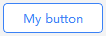
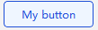
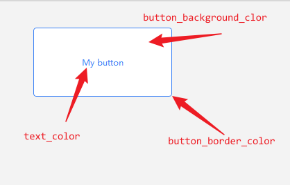

<font size="6">**JuButton**</font>

---

<div style="text-align: center;">
	<span>English</span>
	|
	<a href="./README_zh.md">中文</a>
</div>

## <font size="6">**ToC**</font>

- [Required](#required)
- [Test environment](#test-environment)
- [Example](#example)
- [Struct](#struct)
	- [ColorSet](#colorset)
		- [Syntax](#syntax)
		- [Picture](#picture)
- [Signals](#signals)
	- [`void SignalButtonPress()`](#void-signalbuttonpress)
	- [`void SignalButtonRelease()`](#void-signalbuttonrelease)
	- [`void SignalButtonClicked()`](#void-signalbuttonclicked)
- [Functions](#functions)
	- [void SetBaseColor(ju\_button::ColorSet colors)](#void-setbasecolorju_buttoncolorset-colors)
	- [void SetHoverColor(ju\_button::ColorSet colors)](#void-sethovercolorju_buttoncolorset-colors)
	- [void SetPressColor(ju\_button::ColorSet colors)](#void-setpresscolorju_buttoncolorset-colors)
	- [void SetAnimationDuration(int ms)](#void-setanimationdurationint-ms)
	- [void SetText(QString text)](#void-settextqstring-text)
	- [void SetFont(QFont font)](#void-setfontqfont-font)
	- [void SetPadding(int padding)](#void-setpaddingint-padding)
	- [void SetPadding(int top, int right, int bottom, int left)](#void-setpaddingint-top-int-right-int-bottom-int-left)

# Required

- **Qt**: ` >= 6`

# Test environment

> **Qt**: `6.11.1`  
> **msvc**: `v143`

# Example

<table style="width: 100%; table-layout: fixed">
	<thead>
		<tr>
			<th style="width: 20%; text-align: center">Image</th>
			<th style="width: 80%; text-align: center">Parameters</th>
		</tr>
	</thread>
	<tbody>
		<tr>
			<td>
				<ul style="gap: 10px; display: flex; flex-direction: column">
					<li>
						<div style="display: flex; align-items: center; gap: 10px;">
							<span style="font-weight: bold">default</span>
							
						</div>
					</li>
					<li>
						<div style="display: flex; align-items: center; gap: 10px;">
							<span style="font-weight: bold">hover</span>
							
						</div>
					</li>
					</li>
					<li>
						<div style="display: flex; align-items: center; gap: 10px;">
							<span style="font-weight: bold">press</span>
							
						</div>
					</li>
				</ul>
			</td>
			<td style="text-align: center;">
				<span> ( default style )</span>
			</td>
		</tr>
	</tbody>
</table>

# Struct

## ColorSet

### Syntax

```cpp
	struct ColorSet
	{
		QColor button_background_color;
		QColor button_border_color;
		QColor text_color;
	};
```

### Picture 

<div style="text-align: center;">
	
</div>

# Signals  

## `void SignalButtonPress()`  

Triggered when the button is pressed.  

## `void SignalButtonRelease()`

Triggered when the button is released.

## `void SignalButtonClicked()`

Triggered when user press and release in button's widget.

# Functions  

## void SetBaseColor([ju_button::ColorSet](#colorset) colors)  

Set colors when button not be pressed and not be hovered.

## void SetHoverColor([ju_button::ColorSet](#colorset) colors)  

Set colors when button be hovered and not be pressed.

## void SetPressColor([ju_button::ColorSet](#colorset) colors)  

Set colors when button not be pressed.

## void SetAnimationDuration(int ms)  

Set animation duration.

## void SetText(QString text)  

Set button text.

## void SetFont(QFont font)  

Set button font.

## void SetPadding(int padding)

Set distance between button's text and button's border.

## void SetPadding(int top, int right, int bottom, int left)

Set distance between button's text and button's border in all directions.