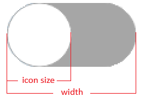
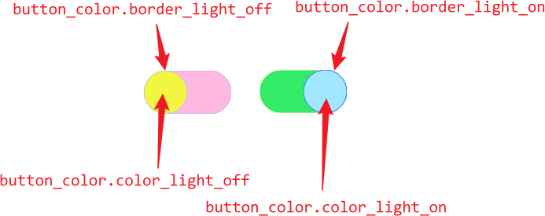
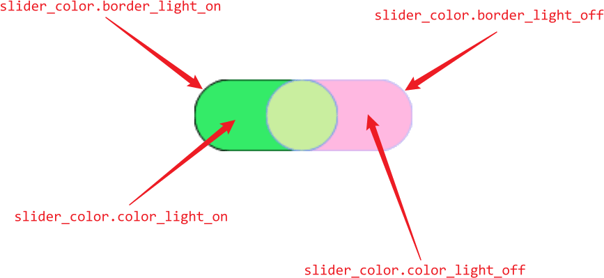

<font size="6">**JuSwitch**</font>

---

<div style="text-align: center;">
	<a href="./README.md">English</a>
	|
	<a href="./README_zh.md">中文</a>
</div>

## <font size="6">**ToC**</font>

- [Required](#required)
- [Test environment](#test-environment)
- [Example](#example)
- [Enums](#enums)
	- [EventListen](#eventlisten)
	- [PaddingBase](#paddingbase)
- [Struct](#struct)
	- [ColorSet](#colorset)
		- [Syntax](#syntax)
		- [Members](#members)
			- [button\_color](#button_color)
			- [slider\_color](#slider_color)
		- [Functions](#functions)
	- [StyleSet](#styleset)
		- [Syntax](#syntax-1)
		- [Members](#members-1)
	- [ParamSet](#paramset)
		- [Syntax](#syntax-2)
		- [Members](#members-2)
- [Signals](#signals)
	- [`void SignalStateChange(bool current_state)`](#void-signalstatechangebool-current_state)
- [Functions](#functions-1)
	- [JuSwitch(QWidget\* parent = nullptr, ju\_switch::ParamSet param = {}, ju\_switch::ColorSet color\_set = {}, ju\_switch::StyleSet style\_set = {})](#juswitchqwidget-parent--nullptr-ju_switchparamset-param---ju_switchcolorset-color_set---ju_switchstyleset-style_set--)
	- [~JuSwitch()](#juswitch)
	- [ju\_switch::StyleSet StyleSet()](#ju_switchstyleset-styleset)
	- [void StyleSet(ju\_switch::StyleSet new\_style\_set)](#void-stylesetju_switchstyleset-new_style_set)
	- [ju\_switch::ParamSet ParamSet()](#ju_switchparamset-paramset)
	- [void ParamSet(ju\_switch::ParamSet new\_param\_set)](#void-paramsetju_switchparamset-new_param_set)
	- [ju\_switch::ColorSet ColorSet()](#ju_switchcolorset-colorset)
	- [void ColorSet(ju\_switch::ColorSet new\_color\_set)](#void-colorsetju_switchcolorset-new_color_set)
	- [bool CurrentState()](#bool-currentstate)
	- [void ChangeState(bool new\_state, bool emit\_signal)](#void-changestatebool-new_state-bool-emit_signal)

# Required

- **Qt**: ` >= 6.5` ( if not, please delete all codes about `JuSwitch::ColorSchemeChangedSlot` )

# Test environment

> **Qt**: `6.11.1`  
> **msvc**: `v143`

# Example

<table style="width: 100%; table-layout: fixed">
	<thead>
		<tr>
			<th style="width: 20%; text-align: center">Image</th>
			<th style="width: 80%; text-align: center">Parameters</th>
		</tr>
	</thread>
	<tbody>
		<tr>
			<td>
				<ul style="gap: 10px; display: flex; flex-direction: column">
					<li>
						<div style="display: flex; align-items: center; gap: 10px;">
							<span style="font-weight: bold">on</span>
							
						</div>
					</li>
					<li>
						<div style="display: flex; align-items: center; gap: 10px;">
							<span style="font-weight: bold">off</span>
							
						</div>
					</li>
				</ul>
			</td>
			<td style="text-align: center;">
				<span> ( default style )</span>
			</td>
		</tr>
		<tr>
			<td>
				<ul style="gap: 10px; display: flex; flex-direction: column">
					<li>
						<div style="display: flex; align-items: center; gap: 10px;">
							<span style="font-weight: bold">on</span>
							
						</div>
					</li>
					<li>
						<div style="display: flex; align-items: center; gap: 10px;">
							<span style="font-weight: bold;">off</span>
							
						</div>
					</li>
				</ul>
			</td>
			<td>
				<pre>
					<code>
/*		Complete code see "Mixed Example" in example.cpp		*/
ColorSet.button_color = 
{
	.color_light_on = QColor{"#5cbbff"},
	.color_dark_on = QColor{"#5cbbff"},
	.color_light_off = QColor{"#a6a6a6"},
	.color_dark_off = QColor{"#a6a6a6"},
	.border_light_on = QColor{"#5cbbff"},
	.border_dark_on = QColor{"#5cbbff"},
	.border_light_off = QColor{"#a6a6a6"},
	.border_dark_off = QColor{"#a6a6a6"},
}
StyleSet = 
{
	.margin = "10%",
	.padding_x_base = ju_switch::PaddingBase::BUTTON,
	.padding_h = "-50%",
	.padding_v = "20%",
}
					</code>
				</pre>
			</td>
		</tr>
			<td>
				<ul style="gap: 10px; display: flex; flex-direction: column">
					<li>
						<div style="display: flex; align-items: center; gap: 10px;">
							<span style="font-weight: bold">on</span>
							
						</div>
					</li>
					<li>
						<div style="display: flex; align-items: center; gap: 10px;">
							<span style="font-weight: bold">off</span>
							
						</div>
					</li>
				</ul>
			</td>
			<td>
				<pre>
					<code>
/*	Complete code see "Switch Change Scheme Example" in example.cpp	*/
ColorSet.button_color = 
{
	.color_dark_off = QColor{ "#000" },
	.border_dark_off = QColor{ "#000" },
}
ColorSet.slider_color = 
{
	.color_dark_off = QColor{ "#c9c9c9" },
}
StyleSet = 
{
	.icon_when_true = (icon when scheme is light)
	.icon_when_false = (icon when scheme is dark)
}
					</code>
				</pre>
			</td>
		<tr>
		</tr>
	</tbody>
</table>

# Enums

## EventListen

**The triggering method of this switch, default value is <kbd>Mouse LButton</kbd> and <kbd>Space</kbd> up**

<table>
	<thead>
		<tr>
			<th style="text-align: center;">
			Enum name
			</th>
			<th style="text-align: center;">
				Value in decimal
			</th>
			<th style="text-align: center;">
				Key
			</th>
		</tr>
    </thead>
	<tbody>
		<tr>
			<td style="text-align: center;">
				<code>MOUSE_LDOWN</code>
			</td>
			<td style="text-align: center;">
				1
			</td>
			<td>
				Mouse left button down
			</td>
		</tr>
		<tr>
			<td style="text-align: center;">
				<code>MOUSE_LUP</code>
			</td>
			<td style="text-align: center;">
				2
			</td>
			<td>
				Mouse left button up
			</td>
		</tr>
		<tr>
			<td style="text-align: center;">
				<code>MOUSE_RDOWN</code>
			</td>
			<td style="text-align: center;">
				4
			</td>
			<td>
				Mouse right button down
			</td>
		</tr>
		<tr>
			<td style="text-align: center;">
				<code>MOUSE_RUP</code>
			</td>
			<td style="text-align: center;">
				8
			</td>
			<td>
				Mouse right button up
			</td>
		</tr>
		<tr>
			<td style="text-align: center;">
				<code>KEY_ENTER_DOWN</code>
			</td>
			<td style="text-align: center;">
				16
			</td>
			<td>
				<kbd>Enter</kbd> down
			</td>
		</tr>
		<tr>
			<td style="text-align: center;">
				<code>KEY_ENTER_UP</code>
			</td>
			<td style="text-align: center;">
				32
			</td>
			<td>
				<kbd>Enter</kbd> up
			</td>
		</tr>
		<tr>
			<td style="text-align: center;">
				<code>KEY_SPACE_DOWN</code>
			</td>
			<td style="text-align: center;">
				64
			</td>
			<td>
				<kbd>Space</kbd> down
			</td>
		</tr>
		<tr>
			<td style="text-align: center;">
				<code>KEY_SPACE_UP</code>
			</td>
			<td style="text-align: center;">
				128
			</td>
			<td>
				<kbd>Space</kbd> up
			</td>
		</tr>
	</tbody>
</table>

## <span id="PaddingBase">PaddingBase</span>

**Which `QWidget` the slider's `padding` value based on**



- `StyleSet.padding_h` end with `%`:
    - `WIDGET`: based on entire QWidget: `StyleSet.padding_h * width`
    - `BUTTON`: based on button center: `(icon_size / 2) + StyleSet.padding_h * (icon_size / 2)`
- `StyleSet.padding_h` end with `px`:
    - `WIDGET`: based on entire QWidget: `StyleSet.padding_h`
    - `BUTTON`: based on button center: `(icon_size / 2) + StyleSet.padding_h`

# Struct

## ColorSet

### Syntax

```cpp
	struct BaseColorSet
	{
		QColor color_light_on;
		QColor color_dark_on;
		QColor color_light_off;
		QColor color_dark_off;
		QColor border_light_on;
		QColor border_dark_on;
		QColor border_light_off;
		QColor border_dark_off;

		static BaseColorSet ButtonDefaultColor()
		{
			return
			{
				.color_light_on = QColor{ "#fff" },
				.color_dark_on = QColor{ "#fff" },
				.color_light_off = QColor{ "#fff" },
				.color_dark_off = QColor{ "#fff" },
				.border_light_on = QColor{ "#a6a6a6" },
				.border_dark_on = QColor{ "#a6a6a6" },
				.border_light_off = QColor{ "#a6a6a6" },
				.border_dark_off = QColor{ "#a6a6a6" },
			};
		}

		static BaseColorSet SliderDefaultColor()
		{
			return
			{
				.color_light_on = QColor{ "#9cd6ff" },
				.color_dark_on = QColor{ "#9cd6ff" },
				.color_light_off = QColor{ "#a6a6a6" },
				.color_dark_off = QColor{ "#a6a6a6" },
				.border_light_on = QColor{ "#9cd6ff" },
				.border_dark_on = QColor{ "#9cd6ff" },
				.border_light_off = QColor{ "#a6a6a6" },
				.border_dark_off = QColor{ "#a6a6a6" },
			};
		}
	};

	struct ColorSet
	{
		BaseColorSet button_color = BaseColorSet::ButtonDefaultColor();
		BaseColorSet slider_color = BaseColorSet::SliderDefaultColor();
	};
```

### Members

**Here only show picture when system color scheme is "light", to customize the dark scheme, just change "light" to "dark" in the variant**

#### button_color



#### slider_color



### Functions

- `BaseColorSet::ButtonDefaultColor`: Get default button color scheme
- `BaseColorSet::SliderDefaultColor`: Get default slider color scheme

> [!NOTE]
> To see how to customize color scheme, see `Change Color Example` or `Mixed Example` or `Switch Change Scheme Example` in `example.cpp`.

## StyleSet

### Syntax

```cpp
	struct StyleSet
	{
		double min_width_height_rate;
		QString slider_radius;
		QString button_radius;
		QString margin;

		PaddingBase padding_x_base;
		QString padding_h;
		QString padding_v;

		QPixmap icon_when_true;
		QPixmap icon_when_false;
	};
```

### Members

<table>
	<thead>
		<tr>
			<th style="text-align: center;">Name</th>
			<th style="text-align: center;">Type</th>
			<th style="text-align: center;">Default value</th>
			<th style="text-align: center;">Description</th>
		</tr>
	</thead>
	<tbody>
		<tr>
			<td style="text-align: center;"><code>min_width_height_rate</code></td>
			<td style="text-align: center;"><code>double</code></td>
			<td style="text-align: center;"><code>2.0</code></td>
			<td>Min value of (width / height), do not lesser than 1.0, or it will be strange!</td>
		</tr>
		<tr>
			<td style="text-align: center;"><code>slider_radius</code></td>
			<td style="text-align: center;"><code>QString</code></td>
			<td style="text-align: center;"><code>"50%"</code></td>
			<td>Slider radius, allow <code>"px"</code> and <code>"%"</code></td>
		</tr>
		<tr>
			<td style="text-align: center;"><code>button_radius</code></td>
			<td style="text-align: center;"><code>QString</code></td>
			<td style="text-align: center;"><code>"50%"</code></td>
			<td>Button radius, allow <code>"px"</code> and <code>"%"</code></td>
		</tr>
		<tr>
			<td style="text-align: center;"><code>margin</code></td>
			<td style="text-align: center;"><code>QString</code></td>
			<td style="text-align: center;"><code>"0%"</code></td>
			<td>Top, right, bottom, left margin of button and slider in the main widget</td>
		</tr>
		<tr>
			<td style="text-align: center;"><code>padding_x_base</code></td>
			<td style="text-align: center;"><code>ju_switch::PaddingBase</code></td>
			<td style="text-align: center;"><code>ju_switch::PaddingBase::WIDGET</code></td>
			<td rowspan="2">See <a href="#PaddingBase">PaddingBase</a></td>
		</tr>
		<tr>
			<td style="text-align: center;"><code>padding_h</code></td>
			<td style="text-align: center;"><code>QString</code></td>
			<td style="text-align: center;"><code>"0%"</code></td>
		</tr>
		<tr>
			<td style="text-align: center;"><code>padding_v</code></td>
			<td style="text-align: center;"><code>QString</code></td>
			<td style="text-align: center;"><code>"0%"</code></td>
			<td>Slider vertical padding, based on (main widget's height - margin * 2)</td>
		</tr>
		<tr>
			<td style="text-align: center;"><code>icon_when_true</code></td>
			<td style="text-align: center;"><code>QPixmap</code></td>
			<td></td>
			<td>Button icon when state is <code>true</code></td>
		</tr>
		<tr>
			<td style="text-align: center;"><code>icon_when_false</code></td>
			<td style="text-align: center;"><code>QPixmap</code></td>
			<td></td>
			<td>Button icon when state is <code>false</code></td>
		</tr>
	</tbody>
</table>

## ParamSet  

### Syntax  

``` cpp
struct ParamSet
{
	bool default_state;	
	int animation_duration_ms;
	
	EventListen events = EventListen::MOUSE_LUP | EventListen::KEY_SPACE_UP;
};
```

### Members

| Name | Type | Default value | Description |
| :--: | :--: | :--: | :-- |
| `default_state` | `bool` | `false` | Switch default state (only worked in **constructor**) |
| `animation_duration_ms` | `int` | `150` | Animation duration (milliseconds), switch won't be triggered again until its animation is over |
| `events` | `ju_switch::EventListen` | `EventListen::MOUSE_LUP \| ju_switch::EventListen::KEY_SPACE_UP` | See [EventListen](#eventlisten) | 

# Signals  

## `void SignalStateChange(bool current_state)`
Triggered when called `ChangeState` and new state != current state.

# Functions  

## JuSwitch(QWidget* parent = nullptr, [ju_switch::ParamSet](#paramset) param = {}, [ju_switch::ColorSet](#colorset) color_set = {}, [ju_switch::StyleSet](#styleset) style_set = {})

Constructor function, can be called without parameters like `auto a = new JuSWitch()`(not recommended to init without parent like this!!!).

## ~JuSwitch()

Destructor function.

## [ju_switch::StyleSet](#styleset) StyleSet()

Get current StyleSet.

## void StyleSet([ju_switch::StyleSet](#styleset) new_style_set)

Set new StyleSet. It will auto set style to button and slider.

## [ju_switch::ParamSet](#paramset) ParamSet()  

Get current ParamSet.

## void ParamSet([ju_switch::ParamSet](#paramset) new_param_set)

Set new ParamSet. It will auto set parameters to button.

## [ju_switch::ColorSet](#colorset) ColorSet()  

Get current ColorSet.

## void ColorSet([ju_switch::ColorSet](#colorset) new_color_set)

Set new ColorSet. It will auto set color to button and slider.

## bool CurrentState()

Get current state.

## void ChangeState(bool new_state, bool emit_signal)

Set new state. If `emit_signal == true`(as default value), it will emit signal [SignalStateChange](#void-signalstatechangebool-current_state).

